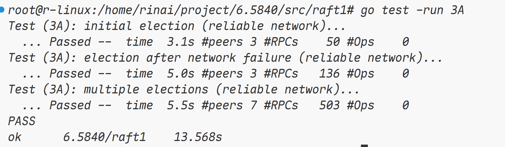
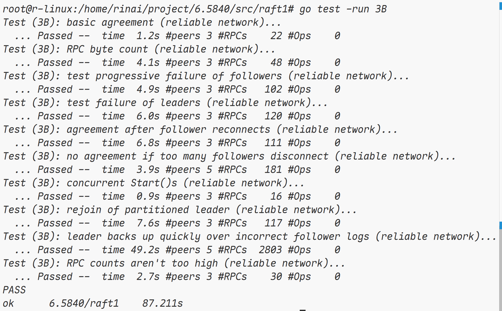
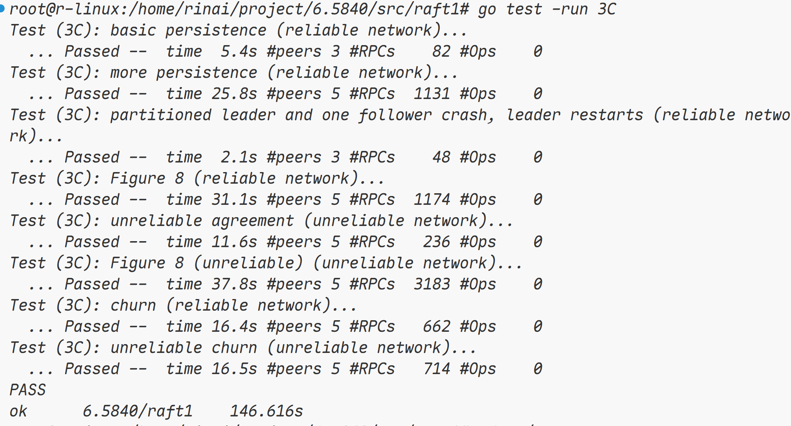
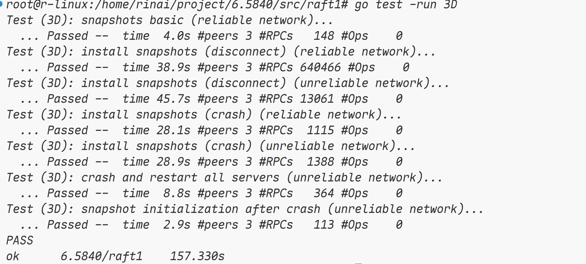
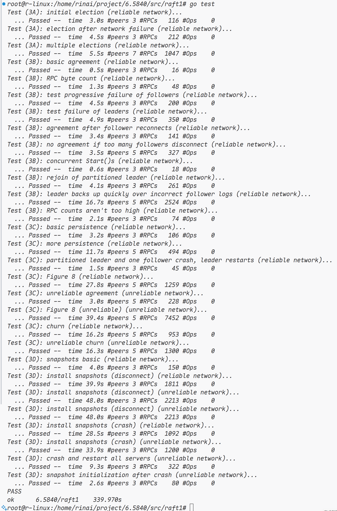
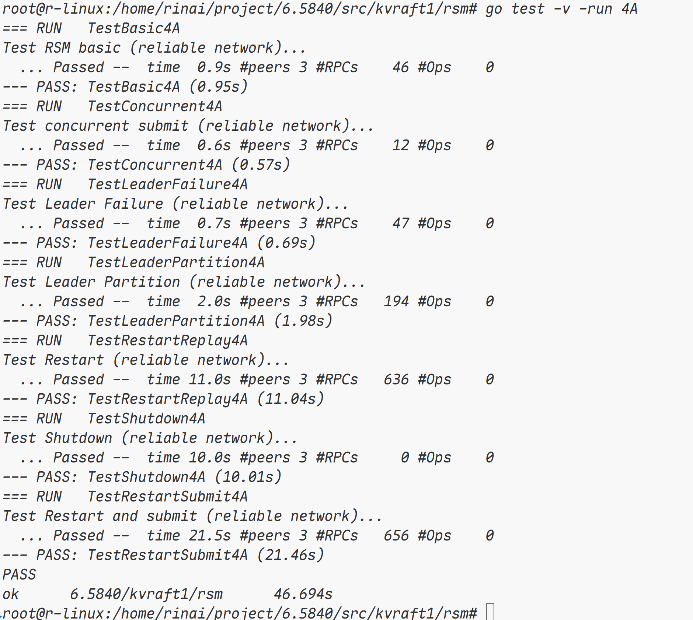
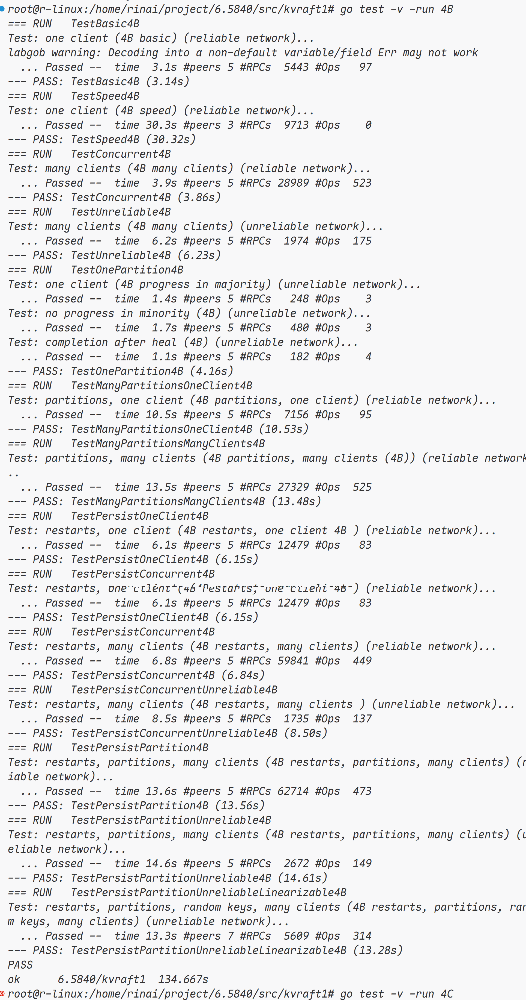
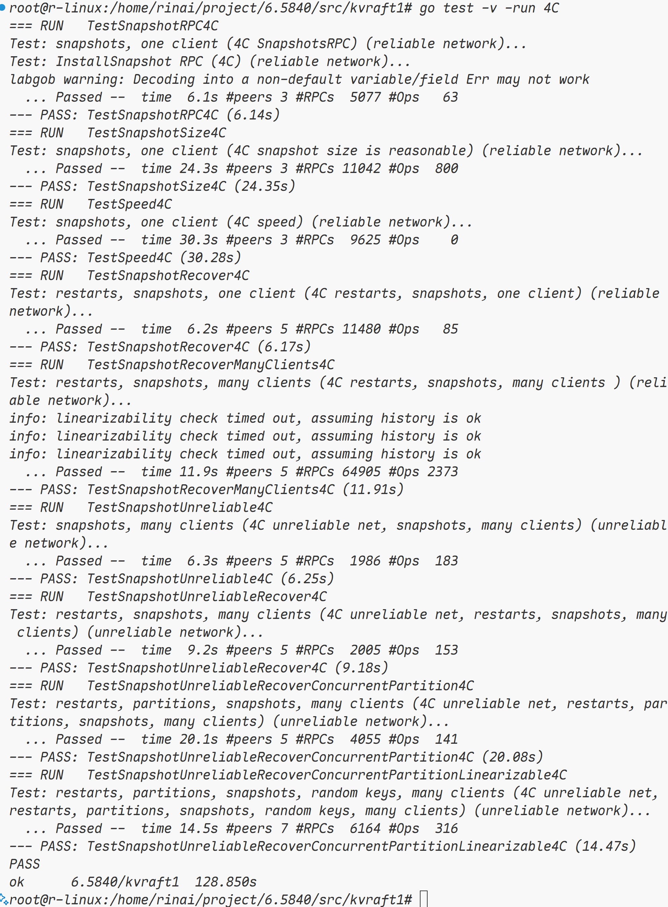

# lab Debug 记录

lab1 和 lab2 都没什么难度，到了 lab3A，我 debug 了一天才通过了测试，故来记录一下。

## lab3A

该实验需要我们实现领导者选举，包括多种场景，比如不可靠的网络，多节点选举。

在观察完 `src/raft1/raft.go` 之后，我认为首先需要补充的部分就是心跳，由于并没有给出心跳的实现，于是我们还需要参考其他的 rpc 请求的方式去实现 `AppendEntry` 此时仅仅是一个架子，并没有进行实现。由于我对 raft 还不是很熟，所以我边看论文，边给 ticker 循环写出了一个大概的框架。

很明显，我们需要在这个循环中执行两种操作

1. 一种是检测 leader 的心跳是否超时或者是否存在 leader，如果实际恰当，就需要发起选举，请求其他节点为自己投票；
2. 第二种是，如果该节点为 leader，则需要向所有节点发送心跳，

首先我们来实现第一种，就是发起选举的操作，什么时候可以发起选举？

如果当前还没有 leader，也就是我们刚刚初始化 raft 集群的时候，此时还没有 leader，我们就可以发起选举，发起选举的时候，我们除了调用 rpc 服务，还需要做几件事情：

1. 将自己的角色标记为 candidate
2. 为自己投票
3. 更新自己的 leaderIdx 为 -1（新的任期，必然没有 leader 或未知 leader）
4. 更新自己的 term

然后我在这里通过循环遍历去发起 rpc 调用，请求其他节点为自己投票，

> [!NOTE]
>
> 然而，之前我也提到过，我们需要在弱网场景下实现 raft 领导者选举，在后期 debug 的时候，我发现不可靠的网络中，rpc 调用可能会阻塞，导致所有 test 无法通过，所以，这里应该改为协程的形式，我们可以通过记录当前发起选举的 term，然后在对应的 rpc 返回的时候，如果发现我们当前节点的 raft 的 term 更新，说明这个返回的信息多半是超时返回回来的，直接舍弃即可，所以我们在这里需要使用协程，而不是循环遍历。

这里我们还有一点是需要做的，我们如果请求为我们投票的节点的 term 更高，应该怎么做？很简单，我们需要在 reply 中标记这一字段，如果对方的任期更大，说明我们已经“过时”了，我们需要立刻退级成 follower，并更新自己的任期，而且立刻修改自己的最近一次的心跳时间，防止自己立刻参与选举，同时每次更新任期的时候，都需要更新自己的所有状态，包括 leader 和为谁投票的字段。

最后，我们如果在中途检测到，我们获取的投票数已经过半，我们的这个节点就可以宣告胜利了，直接登顶为 leader，并立刻发起一轮心跳。

> [!NOTE]
>
> 对于这一点，后期针对于上面的 goroutine 的修改还有需要改善的地方，那就是我们需要检测当前获取过半的票数的 term，以及各种状态是否对得上来兜底，防止我们以及在新的任期了，但是旧的任期选举成功变成 leader 这种奇怪的情况发生。

然后我们需要处理的是，请求其他节点为自己投票的逻辑，我们需要搞清楚，什么时候其他节点可以投票，什么时候应该拒绝。

当请求投票时，如果 candidate 的 term 小于被请求的节点，那么这个节点应该拒绝投票，并返回自己的任期，告诉对方：“你的任期太老了，应该换成更新的任期”。

除此之外，当 candidate 任期大于该节点的时候，我们应该更新该节点的任期，并更新各种信息，比如投票的对象，leader，和 role。

最后，我们唯一判断是否应该投票的标准就是，他的投票的对象的字段是否为空，如果为空，那么就可以投票，否则拒绝，不管自己是 candidate 还是 leader，因为从根本来说，如果这个人是 leader 或者 candidate，他的投票的对象的字段始终都是自己，不可能为空。

最后，我们需要实现的是心跳的逻辑，这里我们也需要处理一些情况，同样应该使用协程去实现心跳，否则会因为各种原因导致 test 失败。

针对于心跳 rpc 的参数，我们需要传递我们的 term 以及 leaderIdx（因为对方可能还不知道我们是 leader，可能需要更改对方的状态和 term），虽说如此，term还可以检验当前的 leader 是否是旧任期的 leader，如果是这样，那么发送心跳失败时候，我们需要降级为 follower。

有几个关键的判断节点，就是旧任期的leader发来心跳，我们需要拒绝，并修改 reply 的参数，表示说：“你是旧时代的 leader，应该变成 follower 了！”，这样来告诉对方，让对方退化为 follower，否则，此次心跳必然是成功的。并且需要更新对方的状态，比如 role，leaderIdx，最近心跳的时间。
最后：

---

## lab3B

主题很明确，日志，我们需要为 raft 添加日志，日志是什么？当 leader 获取到客户端的命令时，将日志写入，然后异步将日志发送给其他节点，同时当过半数的节点写入了这条日志，就会认为这条数据安全，然后给客户端返回写入成功的消息并且推进 commitIdx。
我们主要的任务就是实现 Start 和补充 appendEntries 的实现。

总算成功了！Debug 将近两天，虽然写得比较烂（看课程官网的测试时间，然后和我的实现相比较就知道了🤣）

偶然看到后面还有个快照的实验，所以我将获取当前索引的方法封装了一下，3B 确实涉及到很多内容，必须要先搭出一个大体的框架才能开始第一步测试，否则完全没法跑🥹，首要的就是把最简单的 Start 实现了，这个很简单，只是 append 日志即可，日志索引相关的问题，我们封装为一个函数，这样 start 就解决了。

然后另一个简单的就是把 applych 解决，这个管道是用来我们推进 commit 的时候，需要真正的发送给应用层执行的命令，我们就不放在 ticker 中了，而是单独启动一个 goroutine 来监听 commitIdx 的变化。

随后再把投票限制一下，有啥投票限制？raft 论文明确指出，日志更新的节点不应该向日志更旧的节点投票，至少，candidate 应该和 voter 应该一样或更新，这样绝大部分杂乱的地方都处理完了，剩下的主要是关于 appendEntries 的逻辑。

关于这个调用，我们除了传递心跳，我们还应该向对方传递 leader 的日志的状态以及 leader 的日志 commit 状态。我们只需要实现这些功能，就可以通过测试样例了，然而这并不简单。

基于课堂的内容，我们可以知道，我们需要为 leader 维护一个 nextLogIdx 的数组，以及 matchLogIdx 的数组，前者用于同步日志时，检测是否有冲突，后者用于同步 commit，也就是认为该日志是“安全”的。

首先需要知道关于 appendEntries 这个 rpc 调用的参数和返回值，针对于每个节点，同步日志需要有同步的日志的前一个日志索引，以及对应的 term，初次之外就是 commitIdx，需要返回冲突的日志 idx 以及冲突的 term，我这里设计为，如果是缺少日志，则 term = -1，如果是冲突了，那么才为 term 赋值便于区分。

那么，我们还需要添加的逻辑有检查我们接受心跳的节点的最后一条日志索引是否大于等于传输过来的 prevIdx，如果小于则说明，缺少日志了，需要将 preIdx 更新为当前 lastLogIdx 的值。

另一种情况是日志产生冲突了，我们必须要拿到没有发生冲突的日志的下一条日志的 term，这里肯定难以直接访问，所以我们只能把当前冲突的 idx 对应的 term 传回 leader，让 leader 将 prevIdx 退回这个 term 的第一条日志的前一条日志。到这里，检查日志冲突和缺少日志就结束了，在我们检查完之后，我们就可以进行日志同步，我们由于直接传输的 logEntry 实例，所以应该直接通过 preIdx 进行阶段并且 append，这是我能想到最简单的办法了，然后这个节点跟着 commitIdx 进行 ++ 就可以了。

其中最困难的部分无疑是 leader 侧的处理，论文中提到，如果 follower 追加失败，leader 会不断的重试，这也是一个关键点，在我的实现中，需要不断循环才能够通过 test，而不能仅仅跟随 ticker 进行心跳。

> [!note]
>
> 我的实现需要在日志同步失败的时候通过 for 循环去不断重试直到日志同步，在同步成功，或者该 leader 过时的时候退出。这样才能够通过测试样例。

回到 leader，一如既往并行发送 rpc 请求，我们初始化 nextLogIdx 数组时，需要添加一个哨兵值，防止数组越界，因为初始化时，nextLogIdx 必然是 0，而 prevLogIdx 是其 -1，所以应该使用一个哨兵值来进行填充。这是一点。

当我们的请求成功时，我们应当检查 matchLogIdx 的推进情况，并且根据日志是否写入过半节点来进行推进 commitIdx，除此之外就是关于处理冲突日志和缺日志的情况了，这里很简单，不必多说。

----

## lab3C

该实验需要为 raft 实现持久化，最开始简单写了一下持久化 log，currentTerm 和 voteFor，结果一下子就过了所有测试样例，随着我多测了几次，发现 10 次会有 6 次 fail🤣，也就是说，我之前的 lab3A 或者 lab3B 实现可能有一些缺陷，debug 了半天，经过部分修改，让通过率变高了，上网一搜，发现绝大多数人都死在了这里，实现持久化并不是什么难事，主要是 lab3C 基于前两个实验，且实验条件更加严格，让之前实验的实现的不足显露出来了。

之后又进行了修改，极大程度上的提高了 pass 率，如何修改的？我这里主要的问题是 fail to reach agreement，意思就是说，在写入一条 command 日志之后，过一段时间来看是否大部分节点都存在这个 command，我通过调整 timeout interval 和心跳频率改善了，同时我的实现中，有的时候会错误的重置 lastHeartBeatTime，raft 论文提到，我们仅能在三种情况下重置这个时间：

1. 给别人投票。
2. 参与选举。
3. 接受心跳。

通过以上的改善，稳定通过。

## lab3D

在我写 lab3D 之前，我做了一些准备，统一封装了我对 log 的操作，并且去掉了哨兵节点，使用 1 索引来确保了操作的简易性，在最开始，我对日志是通过 0 索引的，并且有一个哨兵节点以防止越界问题，这就导致我在实现 snapshot 时需要做日志截断出现了问题，所以全部重写（只是 3D 部分），然后对 log 做统一封装并使用 1 索引模式。

芜湖，今天 9 月 2 号总算是写出来了！！辛苦我 debug 两天！！不得不说，这个日志压缩最开始感觉确实没有什么意思，但是 pass 的那一刻，感觉花的时间都值了🥹。

hh，比官方的实现更快地通过了 test，不枉我这么久的努力，虽然代码写得不怎么样，但是确实很让人兴奋。

大致的实现是这样的，虽然 3C 的 persist 方法并没有加锁，因为是自己内部调用的，然而 snapshot 这个方法需要加锁才行，因为外部会直接调用 snapshot，并且不会持有锁。

在 snapshot 的实现中，我这里额外保存了 lastSnapshotIndex 和 lastSnapshotTerm 字段（记得改 persist 方法），方便恢复 commitIdx 和 lastAppliedIdx（PS：这里很重要，每次恢复数据（也就是 readPersist）或者 rpc 调用安装快照的时候都需要更新这两个字段），同时，我们截断日志的时候需要明确，传入的 index 到底是什么，是快照的最后一条日志的 index，所以截断之后的日志不能包括这条日志，而我们 go 语言里面的截断数组的 [l:r],遵循的是 [l,r) 的形式，这里一定要注意！否则就会导致截断出现错误。

同时，调用 persister.Save() 的时候也要特别注意，如果你一个传入 nil，一个传入 data，他并不会无视你的 nil，而是会将 nil 当作是你传入的数据进行覆盖🤣，我们可以选择修改测试框架，也可以选择重新读取一边数据来进行保存，我这里选择的是后者。

之后我们再来写 rpc 调用 installSnapshot，这个方法是 leader 在心跳之中发现对方的日志相当落后，而自己的那部分日志已经压缩成数据了，此时我们只能通过 installSnapshot rpc 调用让对方的数据同步。

其实实现的思路和接受心跳非常类似，加锁，检查任期是否落后，如果自己任期落后或者对方任期落后都需要更新状态，然后我们必须要更新 commitIdx 和 lastAppliedIdx，最后写一个无锁版本的 snapshot 就可以了，别忘了把 install 之后要把数据扔给 applyCh。

最后的最后，贴一下我通过所有 3B 测试的图：

## lab4A

没啥难度，也就是让我们基于 lab3 的 raft 实现一个状态机，需要注意的就是我们的 submit 内部的提交只能是异步的，理由的话，如果你是写完了 lab3 就能够知道了，我们可以通过创建一个 ch，来表示提交的指令日志是否认为是“安全”的，我们可以提前获取一个递增不重复的id，可以用雪花算法，也可以是 uuid，我这里用的雪花算法，如果你使用自增 id 的话，会出现问题，因为重启之后，自增id 又会变成0，随意我推荐雪花算法。

我们通过哈希表来建立 id 到信号管道的映射，以此来传递这条命令的执行结果，我们需要启动一个 ApplyMsg 的 goroutine 去接受下层的 raft 提交的日志或者 snapshot，然后将回复通过 op 的 id 传递到管道，而我们的 submit 可以通过 select 去检查是否有数据，值得注意的是，这里我们不应该设置超时时间，而是使用一个 ticker 去定期检查我们的当前节点的 status，term 是否发送改变？该节点是否为 leader？以此来返回 wrongLeader 错误。

## lab4B

唯一值得注意的是需要在 client 侧发送的命令做去重，把 reqId 和 clientId 放到 args 里面，在状态机中做去重，此时就不需要管 lab2 中提到的 ErrMaybe 错误了，因为我们已经做了去重。经过多次测试，均可 pass

## lab4C

每次状态机执行命令的时候，需要判断日志大小，然后做快照，然后每次 make 的时候恢复快照，就过了。

---

## 总结

6.5840 的实验部分至此完结，总体来说，lab4 写的比较烂，不推荐参考，lab3 有一个优化的点就是我的日志始终只有通过心跳才能够同步，所以效率比较低，我的建议是通过 sync.Cond 也就是通过信号来快速同步，这样可以大大提高效率。

学这门课，写 lab 的体验很不错，实验介绍很详细，Test 的体验也很舒服，推荐大家学一下这门课，实验除了 lab3 的 debug 有点难受，其他都不难，从手写 raft 到基于 raft 状态机实现一个键值对服务器也确实能长见识。